# iOS-Port — Haskell MathCore als WebAssembly

> Ziel: das Spiel auf einem aktuellen Apple-Tablet mit Bluetooth-Controller fliegbar
> machen — ohne den Haskell-MathCore neu zu schreiben. Der Weg: **denselben**
> Haskell-Code als WASM bauen und über den wasm3-Interpreter einbetten.
> Derselbe Mechanismus trägt danach den Android-Port.

## Warum WASM (und nicht Cross-GHC oder lipo)

- **iOS verbietet dlopen fremder dylibs** → der MathCore muss statisch in die App.
- **iOS verbietet JIT (W^X)** → native Haskell (Cross-GHC) wäre *theoretisch*
  möglich, aber `arm64-apple-ios`-GHC existiert nicht als fertige Toolchain.
- **lipo löst nichts** — es merged nur *bereits gebaute* Thin-Binaries. Der harte
  Teil ist, aus Haskell überhaupt `arm64-apple-ios`-Objekte zu bekommen.
- **GHC 9.6.7 (bereits installiert) hat einen WASM-Backend** (`wasm32-wasi-ghc`).
  Ein `.wasm` läuft — interpretiert statt nativ — auf **allen** Architekturen
  (Device *und* Simulator, später Android) identisch. Kein Rewrite, keine zweite
  Quelle, **ein** Artifact.

Der MathCore ist kein Formelkatalog, sondern ein zustandsbehafteter Regelkreis
(17 Module, ~3000 Zeilen, `StablePtr (IORef FwContext)`). Codegen wäre
Compiler-Bau; Cross-Kompilieren ist der einzige Weg ohne Duplikation.

## Architektur

```mermaid
graph LR
    A[Haskell MathCore<br/>17 Module] -->|wasm32-wasi-ghc| B[born2flap_math.wasm]
    B -->|eingebettet| C[Born2FlapMathWasmBackend.cpp<br/>b2f_math_* über wasm3]
    D[wasm3 Interpreter<br/>C99, MIT] --> C
    C -->|statische b2f_math_* Symbole| E[Born2FlapMathBridge.cpp]
    E --> F[Born2FlapFlightPawn]
    style C fill:#3a2a1a,stroke:#c8553d
```



Der ABI-Vertrag ist unverändert (`Native/include/born2flap_math.h`, 13 POD-Funktionen).
Nur die *Rückseite* von `Born2FlapMathBridge.cpp` ändert sich: statt
`FPlatformProcess::GetDllHandle` bindet der iOS-Zweig die statisch gelinkten
`b2f_math_*`-Symbole direkt.

## Voraussetzungen

1. **Disk freigeben** (aktuell 99 % voll, ~7 Gi frei — Toolchain braucht ~2 Gi,
   iOS-Build weitere ~2–3 Gi). Sichere Kandidaten: `~/Library/Caches` (17 G),
   `Unreal/Born2Flap/Intermediate`, `Saved/{StagedBuilds,Cooked,Shaders}`.
2. **WASM-Toolchain installieren** (einmalig):
   ```bash
   git clone https://gitlab.haskell.org/ghc/ghc-wasm-meta ~/ghc-wasm-meta
   cd ~/ghc-wasm-meta && ./setup.sh   # installiert wasi-sdk + wasm32-wasi-ghc + wasmtime
   ```
3. **wasm3 vendoren** (MIT, interpreter, kein JIT → iOS-legal):
   ```bash
   git submodule add https://github.com/wasm3/wasm3.git Native/ThirdParty/wasm3
   ```

## Schritte

### 1. MathCore → WASM

`Tools/build-math-wasm.sh` (bereit) ruft:

```bash
wasm32-wasi-ghc -isrc -icbits -O2 -no-hs-main \
  -optl-mexec-model=reactor \
  src/Born2Flap/Math/FFI.hs cbits/bridge.c \
  -o dist-newstyle/born2flap_math.wasm
```

Die `foreign export ccall`-Funktionen (`hs_b2f_math_*`) werden zu WASM-Exports.
**Verifizieren:** `wasm-objdump -x born2flap_math.wasm | grep -i b2f` und ein
wasmtime-Smoke-Test (Create → Step → Destroy mit bekannten Eingaben).

### 2. Adapter: `b2f_math_*` über wasm3

`Born2FlapMathWasmBackend.cpp` implementiert denselben C-ABI, intern:
- embedded `.wasm` parsen (`m3_ParseModule` → `m3_LoadModule`),
- `malloc`/`free` des WASM-Linearspeichers für die POD-Structs,
- `m3_FindFunction` für jede `b2f_math_*`-Exporte,
- Marshalling: Struct → linearen Speicher schreiben → call → zurücklesen,
- `B2F_MathContext*` ist ein `i32`-Pointer in den GHC-Heap, wird opaque
  round-tripped (kein GC-Root-Handling nötig — alles POD).

### 3. Build.cs: iOS/Android

`Born2Flap.Build.cs` bekommt einen `Target.Platform == IOS`-Zweig:
- wasm3-Quellen als statische `.a` (`Tools/build-wasm3-ios.sh`, `arm64-apple-ios`
  + `arm64-apple-ios-simulator`, `lipo` am Ende),
- Adapter-Source + `Native/include`-Pfad,
- `PublicAdditionalLibraries.Add(...)`.

### 4. Bridge: statischer Zweig

`Born2FlapMathBridge.cpp::Load()` bekommt einen `#if PLATFORM_IOS`-Zweig, der
die Funktionszeiger **direkt** setzt (`StepFirmwareVehicle = &b2f_math_step_firmware_vehicle;`)
statt `GetDllExport`. Desktop-Pfad bleibt unverändert.

## Der eigentliche Integrationspunkt

`Unreal/Born2Flap/Source/Born2Flap/Math/Born2FlapMathBridge.cpp` lädt heute per
`GetDllHandle`/`GetDllExport` die dylib (`libborn2flap_math.dylib` / `.dll` / `.so`).
Genau dort zieht der statische iOS-Zweig ein. Der restliche UE-Code
(`Born2FlapFlightPawn`, `Born2FlapWingMesh`, `Born2FlapWind`) ist unberührt.

## Blockiert durch

- **Disk (99 % voll)** — Toolchain-Install + iOS-Build brauchen Platz.
- **Kein `wasm32-wasi-ghc`** installiert (Toolchain fehlt, Netz vorhanden).

## Reihenfolge der nächsten Sitzungen

1. Disk freigeben → Toolchain installieren.
2. `build-math-wasm.sh` ausführen → Exporte + wasmtime-Smoke verifizieren.
3. wasm3 vendoren + für `arm64-apple-ios`/`-simulator` bauen.
4. Adapter vervollständigen → `Born2FlapMathBridge`-iOS-Zweig → Build.cs.
5. UE-iOS-Paket bauen → auf Gerät mit Bluetooth-Controller testen.
6. Dasselbe Muster für Android (gleiche `.wasm` + wasm3-NDK-Build).
