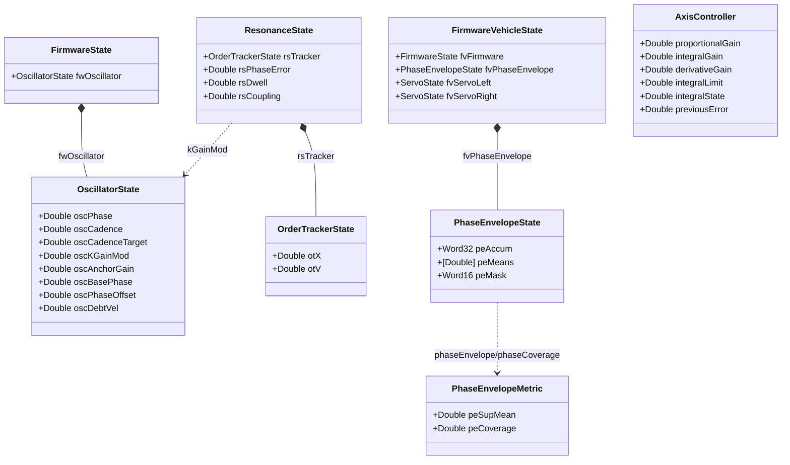
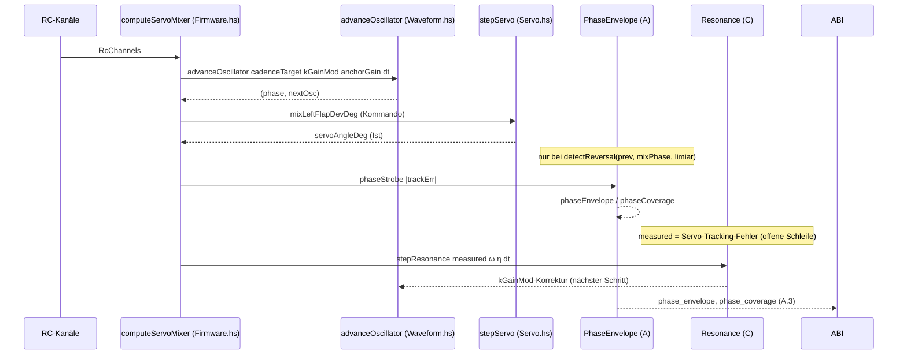

# ONDAS-Stabilisierung — Rubedo: Technische Spezifikation & Build-Reihenfolge

> Rubedo-Dokument: der gewählte **Stein**. Finalisiert die Implementierungsdetails,
> friert Schnittstellen und Zahlen ein und zerlegt die Arbeit in testbare
> Meilensteine. Baut auf dem Albedo-Plan
> [`ondas-stabilization-plan.md`](ondas-stabilization-plan.md) (Was/Warum, §0–§7)
> und dem Citrinitas-ADR
> [`decisions/0002-ondas-stabilization-paths.md`](decisions/0002-ondas-stabilization-paths.md)
> (Pfadwahl, §8) auf. Dieses Dokument ist die **einzige Build-Quelle** für die
> Solve-Phase; Abweichungen erfordern ein revidiertes ADR.

---

## 1. Der Stein — gewählte finale Muster (verbindlich)

| # | Entscheidung | Gewählt (final) | Verworfen (als Regressionstest eingefroren) |
|---|---|---|---|
| P1 | Phase-Envelope-Schicht | Haskell `PhaseEnvelope.hs`, IO-frei | C++ OrniCore / Python-nur |
| P2 | Strobe-Sampler | Golden-Angle-Akkumulator `648095`, `bin=(acc>>16)&0xF` | Phasen-indizierter Raster, fester Zeit-Strobe |
| P3 | Reversal + Strobe-Größe | Sinusoid-Nulldurchgang; Strobe-Größe `|pitchErrorRate|` (offene Schleife) | Phase-Sprung-π; Flap-Phase als Strobe |
| P4 | Ferocity-Preis-Validierung | Haskell-Unit + Python-DLL (komplementär) | nur Haskell / nur Python |
| P5 | Preis-Assertion | einseitig „von unten“ `P_gemessen ≤ P_analytisch` | symmetrisches ±X % |
| P6 | RESONANCE-Tracker | Vold–Kalman 1. Gen (ζ=0.06, w=ω) | fester BP / PLL / EKF |
| P7 | Kopplungs-Frame | `sin(2δ)` Fehler-Frame | `sin(2θ)` Lab-Frame (verboten) |
| P8 | Injektionspunkt | `kGainMod` (ersetzt hartes `1` in `Firmware.hs:418`) | direkter Phasen-Offset / `cadenceTarget` |
| P9 | Washboard ↔ Dwell | geschichtet (Beat-Lock + Fein-Lock) | Ersatz des Washboard |

Negativ-Kontrollen (fester Raster A.4.2, fester BP C.4.1, `sin(2θ)` C.4.3) sind
**Teil des Lieferumfangs**, nicht optional.

---

## 2. Modul-Inventar & Typ-Abhängigkeiten



**Neu (Solve-Phase):** `PhaseEnvelope` (P1), `OrderTracker` (P6), `Resonance` (P7),
Ferocity-Preis-Helfer (P4, eigenes Modul `FerocityPrice.hs`).
**Erweitert:** `FirmwareVehicleState` um `fvPhaseEnvelope`; `Firmware.hs` um
`kGainMod`-Durchgriff. **Unverändert:** `Control.hs` (Basis-PID bleibt; RESONANCE
legt sich **darüber**, ersetzt ihn nicht).

---

## 3. Finale Schnittstellen (kompilierfähig)

### 3.1 Ferocity-Preis-Helfer (P4) — neu in `MathCore/src/Born2Flap/Math/FerocityPrice.hs`

```haskell
module Born2Flap.Math.FerocityPrice
  ( dwellFromFerocity
  , ferocityPowerPrice, ferocityForcePrice, ferocityThrustPrice
  ) where

-- d = ferocity01 · kWaveMaxDwell, ferocity01 = f·0.125, kWaveMaxDwell = 0.98.
dwellFromFerocity :: Double -> Double
dwellFromFerocity f = clamp 0 8 f * 0.125 * 0.98

-- Audit-verifizierte Quittung (9.5). Nur Skalierung, keine Absolutwerte.
ferocityPowerPrice  :: Double -> Double  -- d → Leistung 1/(1-d)³
ferocityPowerPrice d = 1 / (1 - d) ** 3

ferocityForcePrice  :: Double -> Double  -- d → Kraft/Drehmoment 1/(1-d)²
ferocityForcePrice d = 1 / (1 - d) ** 2

ferocityThrustPrice :: Double -> Double  -- d → Schub 1/(1-d)
ferocityThrustPrice d = 1 / (1 - d)
```

Kanonische Stützwerte (Unit-Test-Referenz): d=0.05 → 1.166/1.108/1.053;
d=0.3 → 2.92/2.04/1.43; d=0.8 → 125/25/5 (Leistung/Kraft/Schub).

### 3.2 `PhaseEnvelope.hs` (P1/P2/P3) — neu

```haskell
{-# LANGUAGE DerivingStrategies #-}
{-# LANGUAGE StrictData #-}
module Born2Flap.Math.PhaseEnvelope
  ( goldenAngleStep, phaseBins, phaseEma
  , PhaseEnvelopeState(..), defaultPhaseEnvelope
  , PhaseEnvelopeMetric(..)
  , phaseStrobe, phaseEnvelope, phaseCoverage
  , detectReversal
  ) where

import Data.Bits
import Data.Word

-- ⌊φ⁻¹·16·2^16⌋ = 648095 (0x9E39F). gcd(648095, 2^20)=1.
goldenAngleStep :: Word32
goldenAngleStep = 648095

phaseBins :: Int
phaseBins = 16

phaseEma :: Double
phaseEma = 0.0625  -- 1/16 pro Strobe

data PhaseEnvelopeState = PhaseEnvelopeState
  { peAccum :: !Word32
  , peMeans :: ![Double]
  , peMask  :: !Word16
  } deriving stock (Eq, Show)

defaultPhaseEnvelope :: PhaseEnvelopeState
defaultPhaseEnvelope = PhaseEnvelopeState 0 (replicate phaseBins 0) 0

data PhaseEnvelopeMetric = PhaseEnvelopeMetric
  { peSupMean  :: !Double
  , peCoverage :: !Double
  } deriving stock (Eq, Show)

phaseStrobe :: Double -> PhaseEnvelopeState -> PhaseEnvelopeState
phaseStrobe errorAbs state =
  let acc'   = peAccum state + goldenAngleStep
      bin    = fromIntegral ((acc' `shiftR` 16) .&. 0xF)
      means' = [ m * (1 - phaseEma) | m <- peMeans state ]
      means''= addAt bin (errorAbs * phaseEma) means'
  in PhaseEnvelopeState acc' means'' (peMask state .|. (1 `shiftL` bin))
  where
    addAt i v xs = take i xs ++ [xs !! i + v] ++ drop (i + 1) xs

phaseEnvelope :: PhaseEnvelopeState -> Double
phaseEnvelope = maximum . map abs . peMeans

phaseCoverage :: PhaseEnvelopeState -> Double
phaseCoverage state =
  fromIntegral (popCount (peMask state)) / fromIntegral phaseBins

-- Sinusoid-Nulldurchgang (P3): Vorzeichenwechsel von sin(mixPhase), faithful zu
-- pid.c:1846. `limiar` = limiarFromFerocities (Down/Upstroke-Grenze).
detectReversal :: Double -> Double -> Double -> Bool
detectReversal prev curr limiar =
  (prev < limiar && curr >= limiar) || (curr < prev)
```

### 3.3 `OrderTracker.hs` (P6) — neu

```haskell
{-# LANGUAGE DerivingStrategies #-}
{-# LANGUAGE StrictData #-}
module Born2Flap.Math.OrderTracker
  ( OrderTrackerState(..), defaultOrderTracker
  , orderTrackerZeta, orderTrackerOmegaMin
  , stepOrderTracker
  ) where

orderTrackerZeta :: Double
orderTrackerZeta = 0.06        -- Q ≈ 8.3

orderTrackerOmegaMin :: Double
orderTrackerOmegaMin = 0.1     -- rad/s: darunter idlen

data OrderTrackerState = OrderTrackerState
  { otX :: !Double
  , otV :: !Double
  } deriving stock (Eq, Show)

defaultOrderTracker :: OrderTrackerState
defaultOrderTracker = OrderTrackerState 0 0

stepOrderTracker :: Double -> Double -> Double -> OrderTrackerState
                 -> (Double, OrderTrackerState)
stepOrderTracker sample omega dt state
  | omega < orderTrackerOmegaMin || dt <= 0 = (0, defaultOrderTracker)
  | otherwise =
      let w  = omega
          bw = 2 * orderTrackerZeta * w
          v' = otV state + (-w*w*otX state - bw*otV state + bw*sample) * dt
          x' = otX state + v' * dt
      in (x', OrderTrackerState x' v')
```

### 3.4 `Resonance.hs` (P7/P8/P9) — neu

```haskell
{-# LANGUAGE DerivingStrategies #-}
{-# LANGUAGE StrictData #-}
module Born2Flap.Math.Resonance
  ( ResonanceState(..), defaultResonance
  , stepPhaseLockDwell, stepResonance
  ) where

import Born2Flap.Math.OrderTracker

data ResonanceState = ResonanceState
  { rsTracker    :: !OrderTrackerState
  , rsPhaseError :: !Double
  , rsDwell      :: !Double
  , rsCoupling   :: !Double
  } deriving stock (Eq, Show)

defaultResonance :: ResonanceState
defaultResonance = ResonanceState defaultOrderTracker 0 0 8.0

-- Parkbrunnen im ROTIERENDEN Frame (P7):
--   dδ/dt = η − 2κ·d·sin(2δ)
stepPhaseLockDwell :: Double -> Double -> Double -> Double -> Double -> Double
stepPhaseLockDwell eta kappa d dt delta =
  delta + (eta - 2 * kappa * d * sin (2 * delta)) * dt

-- RESONANCE-Schritt: Tracker → Phasenfehler δ → kGainMod-Korrektur.
-- Rückgabe = Phasen-Advance-Bedarf (kGainMod), KEIN Stellwinkel.
stepResonance
  :: Double -> Double -> Double -> Double -> ResonanceState
  -> (Double, ResonanceState)
stepResonance measured omega eta dt st = ...
```

### 3.5 Integrationspunkte (verbindlich)

**C-Injektion (P8), `Firmware.hs:418`:**

```haskell
-- VORHER: (phase, nextOsc) = advanceOscillator cadenceTarget 1 (fwAnchorGain params) dt (fwOscillator state)
-- NACHER:
--   kGainMod = 1 + resonanceCorrection   -- aus stepResonance, Default 0
--   (phase, nextOsc) = advanceOscillator cadenceTarget kGainMod (fwAnchorGain params) dt (fwOscillator state)
```

`advanceOscillator` bleibt der **einzige** Phasen-Integrator. `kGainMod` ist der
einzige Eintrittspunkt der RESONANCE-Schicht in die Oszillator-Dynamik.

**A-Injektion (P3), `FirmwareVehicle.hs` `advanceFirmwareVehicle`:**

`FirmwareVehicleState` bekommt `fvPhaseEnvelope :: !PhaseEnvelopeState`. Nach
`stepServo` (wo `mixPhase` und `servoAngleDeg` bekannt sind) pro Schritt:

```haskell
prevPhase = oscPhase (fwOscillator (fvFirmware state))
limiar    = limiarFromFerocities (mixStrokeFerL mix) (mixReturnFerL mix)
reversal  = detectReversal prevPhase (mixPhase mix) limiar
trackErr  = abs (mixLeftFlapDevDeg mix - servoAngleDeg nextServoL)  -- deg
peNext    = if reversal then phaseStrobe trackErr (fvPhaseEnvelope state)
                        else fvPhaseEnvelope state
```

Gestrobte Größe = `|Servo-Tracking-Fehler links| [deg]` (offene Schleife, vor RESONANCE).

---

## 4. Datenfluss (ein Integrationsschritt, 240 Hz)



`RES` und `PE` sind reine Funktionen; der Loop bleibt der bestehende
`advanceFirmwareVehicle`. Kein neuer globaler Zustand außer `fvPhaseEnvelope`.

---

## 5. Exakte Konstanten & Datentypen (eingefroren)

| Name | Wert | Quelle/Verifikation |
|---|---|---|
| `goldenAngleStep` | `648095` (0x9E39F) | ⌊φ⁻¹·16·2^16⌋, gcd(·,2^20)=1 |
| `phaseBins` | `16` | Poincaré-Bins |
| `phaseEma` | `0.0625` | 1/16 pro Strobe |
| `orderTrackerZeta` | `0.06` | Q≈8.3 (sim-validiert) |
| `orderTrackerOmegaMin` | `0.1` rad/s | Idle-Schwelle |
| `kWaveMaxDwell` | `0.98` | Waveform.hs (bestehend) |
| `defaultResonance` κ | `8.0` | Note 94, sim_ferocity.rb |
| Ferocity-Preis | 1/(1−d)³, 1/(1−d)², 1/(1−d) | 9.5 audit-verifiziert |
| Jitter-Reduktion | 10.8× (d=0.05), 43× (d=0.8) | Note 94, ±10 % |

**ABI v3 (`born2flap_math.h`) — append-only:**

```c
#define B2F_MATH_ABI_VERSION 3u
typedef struct B2F_FirmwareOutput {
    double force_n[3];             /* 0..2  */
    double moment_n_m[3];          /* 3..5  */
    double mechanical_power_w;     /* 6 */
    double maximum_separation;     /* 7 */
    double left_flap_deg;          /* 8 */
    double right_flap_deg;         /* 9 */
    double battery_soc;            /* 10 */
    double phase_envelope;         /* 11  NEU */
    double phase_coverage;         /* 12  NEU */
    uint32_t flags;                /* Byte-Offset 104 */
} B2F_FirmwareOutput;
```

`FFI.hs` `pokeFwOutput`: 11 → **13** Doubles (`phaseEnvelope`, `phaseCoverage` vor
`flags`), `flags` auf Byte-Offset 104. `flight_regression.py` `Output`:
`c_double * 11` → `c_double * 13`. C++-Fallback
(`Native/src/born2flap_math_bridge.cpp`): beide neuen Felder `0.0`.

---

## 6. Abhängigkeiten & Bibliotheken

**Keine neuen Third-Party-Abhängigkeiten.** Alles auf bestehendem
GHC-9.10.3/cabal-Stack (Haskell), ctypes (Python-Tests) und dem C-Header-ABI.
Die vier neuen Module sind `base`-only (kein `containers`/`vector`/`random` nötig;
Listen mit 16 Elementen, deterministisches η via linearem Kongruenz-Generator für
die ODE-Reproduktion). Kein neues cabal-`build-depends`.

---

## 7. Meilensteine & Build-Reihenfolge

Kritischer Pfad: **M1 → M2 → M4 → M5 → M6**. M0 und M3 sind parallel (unabhängig).

| Meilenstein | Inhalt | Abhängig von | Testbar | Parallele Spur |
|---|---|---|---|---|
| **M0** Ferocity-Preis | `FerocityPrice.hs` (3.1) + `ferocityPriceWave`-Unit (B.2) | — | `cabal test` | Spur B |
| **M1** OrderTracker | `OrderTracker.hs` (3.3) + C.4.1 | — | `cabal test` | Spur C |
| **M2** Resonance | `Resonance.hs` (3.4) + C.4.2/C.4.3 | M1 | `cabal test` | Spur C |
| **M3** PhaseEnvelope | `PhaseEnvelope.hs` (3.2) + A.4.1/A.4.2 | — | `cabal test` | Spur A |
| **M4** Haskell-Integration | A-Injektion (fvPhaseEnvelope) + C-Injektion (kGainMod) | M2, M3 | `cabal test` | — |
| **M5** ABI v3 | Header + FFI.hs + C++-Fallback + Python-Output (13 Doubles) | M4 | DLL-Build + alter Regressionstest | — |
| **M6** Python-DLL-Tests | `ferocity_price.py`, `phase_envelope.py`, `resonance.py` | M5 (+M0, M2) | `Native/tests/` | — |

**Drei unabhängige Spuren vor M4:**
- **Spur A (Diagnostic):** M3 — rein, kein Risiko, blockiert nur M4→M5.
- **Spur B (Preis):** M0 — rein, blockiert `ferocity_price.py` (M6).
- **Spur C (Resonance):** M1→M2 — rein, kritischer Pfad.

`cabal`-Schritt in M4: neue Module `PhaseEnvelope`, `OrderTracker`, `Resonance`,
`FerocityPrice` in `exposed-modules` (born2flap-math.cabal) und in
test/Main.hs-Importe aufnehmen.

---

## 8. Definition of Done je Meilenstein

| Meilenstein | DoD (prüfbar) |
|---|---|
| M0 | `dwellFromFerocity`+3 Preis-Funktionen; Stützwerte 9.5 eingefroren; `ferocityPriceWave` belegt 1/(1−d)-Skalierung (shapeMix=0, ±1 %) |
| M1 | Unity-Gain bei `sin(ωt)`; Chirp 2.4→7.2 rad/s hält ρ(Tracker)<−0.4; `ω<0.1`⇒Ausgang 0+Reset |
| M2 | `stepPhaseLockDwell` reproduziert 10.8×/43× (±10 %); Lab-Frame-Variante liefert keine monotone Verbesserung („verboten“) |
| M3 | Coverage==1.0, 4096/Bin nach 2¹⁶ Strobes; `phaseEnvelope(golden)<0.65` und `<` fester Raster |
| M4 | `fvPhaseEnvelope` gefädelt; `kGainMod` ersetzt `1` (Firmware.hs:418); `advanceOscillator` einziger Phasen-Integrator; alte Tests unverändert grün |
| M5 | ABI v3 append-only; bestehende Offsets 0..10 unverändert; Flags bei Byte 104; alter Regressionstest grün (kein Replay-Bruch) |
| M6 | `ferocity_price.py`: P_gemessen ≤ P_analytisch ∀f (von unten); `phase_envelope.py`: Strobe schlägt nicht, fester Raster schlägt + 30/60/144-FPS-Coverage→1.0; `resonance.py`: Kopplung senkt `phase_envelope` |

Globale DoD (aus `implementation-plan.md` übernommen): dokumentierte Annahme,
ohne Unreal testbar, numerische Grenzfälle eingefroren, Telemetrie
(`phase_envelope`/`phase_coverage`), Performancebudget (16-Bin-EMA + 2-Zustands-
Resonator: O(1) pro Schritt, kein Allokationswachstum), keine Replay-Brüche.

---

## 9. Risiken & Rollback

| Risiko | Minderung |
|---|---|
| ABI-Offset-Fehler (13 Doubles) | append-only; alter Regressionstest läuft unverändert als Kanarienvogel |
| `sin(2θ)`-Rückfall (Lab-Frame) | C.4.3 als permanenter „verboten“-Test eingefroren |
| Preis-Abweichung bei shapeMix>0 | als offenes Ticket dokumentiert (B.2), nicht stillschweigend „korrigiert“ |
| Kalibrierung (κ, σ, Watt absolut) | nur relative/numerische Regression; keine physische Kalibrierung in dieser Stufe |

---

*Der Stein ist gewählt: vier IO-freie Haskell-Module, ein append-only-ABI-Bump,
drei Python-DLL-Regressionstests. Die Solve-Phase implementiert M0–M6 exakt in
dieser Reihenfolge.*
