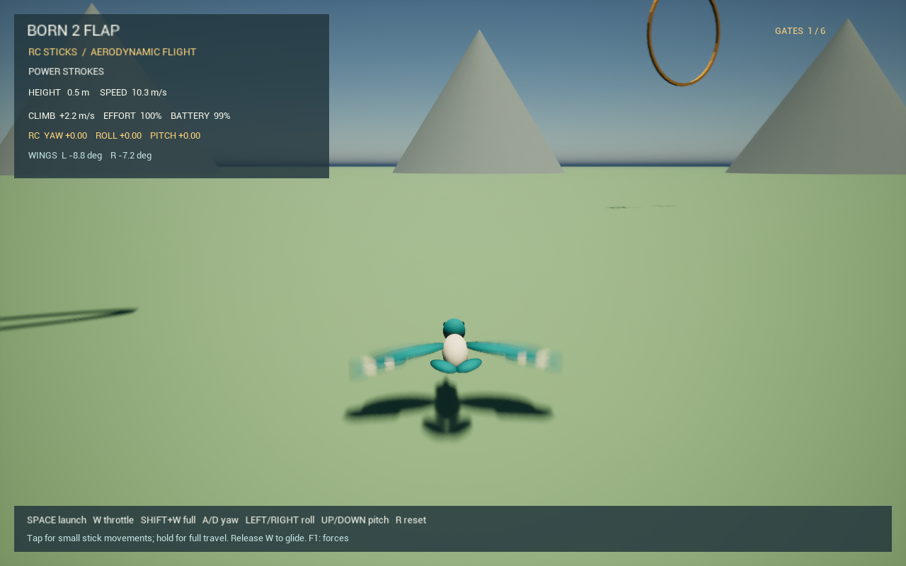

# RC controls and aerodynamic authority

The keyboard now moves four virtual transmitter channels. It does not request
a heading or bank angle. The complete path is keyboard stick slew and expo →
normalized RC channels → mixer → loaded servos → wing/tail airflow → forces and
moments → Chaos. The former attitude torque, automatic turns and generic angular
damping are removed. A pilot can stall, sideslip or lose height in a turn.



## Controls

| Keyboard | RC channel | Action |
| --- | --- | --- |
| Hold W | Throttle 0.72 | Medium power, including on the ground |
| Hold either Shift + W | Throttle 1.0 | Full power |
| Release W | Throttle 0 | Glide; wing-position controls remain active |
| A / D | Rudder/yaw − / + | Differential flapping amplitude; differential glide position; rudder surface |
| Left / Right arrows | Aileron/roll − / + | Opposite stroke timing/skew and differential wing position |
| Down / Up arrows (S also down) | Elevator/pitch − / + | Symmetric wing-position change and elevator surface |
| Space | Hand launch | Supplies initial momentum once while resting on the ground |
| R | Reset | Recreates body and all native state |
| F1 | Display | Aerodynamic force and gravity arrows |

Steering sticks take 0.8 s to move from centre to full deflection and 0.4 s to
return from full deflection after release. Reversing direction also slews.
The output curve is `0.35*s + 0.65*s^3`: a 100 ms key tap reaches about 4.5%
channel output, rather than applying an instant full-stick command. Throttle
slews at 2.5 normalized units/s. Equal opposite keys request neutral.

The HUD shows actual post-expo yaw/roll/pitch channels and both loaded wing
angles. `FlightTelemetry` records the same channels as `rc=(roll,pitch,yaw)`.
The logical ABI accepts throttle `[0,1]` and independent sticks `[-1,1]`; the
keyboard adapter is separate from the aerodynamic mixer. Windows USB/vJoy
transmitter discovery and calibration are now available through F3; see
[natural-valley-and-rc.md](natural-valley-and-rc.md).

## Shared wing mechanics

Rudder changes left/right commanded amplitude by `1 +/- 0.35*yaw`. Aileron
changes their stroke/return duration and within-stroke skew in opposite
directions, while retaining the common oscillator. Reversals are bounded to
20–80% of the cycle. Thus different downstroke speeds can create roll without
inventing a roll torque or changing the nominal amplitude.

Position terms now reach the physical flap coordinates in both modes; the old
code discarded them. The glide command, in degrees before actuator limits, is:

```
common       = 4 - 10.8*pitch
differential = 15*(-roll + 0.65*yaw)
left         = common - differential
right        = common + differential
```

The two commands share the +/-80 degree mechanical travel. For example,
`yaw=0.5, roll=0.325` cancels the differential glide-wing request. Rudder and
aileron cannot independently dictate incompatible positions of the same wing.
The tail rudder has its own configured `0.65*yaw + 0.35*roll` mix, so cancelling
wing differential does not imply cancelling every aerodynamic yaw effect.
Actuator load, rate, response time and battery sag still limit actual motion.

The mixer is derived from the firmware port, with intentional simulator
extensions for glide and asymmetric aileron timing. It is no longer described
as bit-identical to the original firmware kernel. CRSF normalization now maps
neutral 992 and both endpoints exactly, avoiding a permanent tiny stick bias.

## Physical corrections needed after removing assistance

The old wing/box inertia setting was misinterpreted: Chaos scales mass geometry,
not individual diagonal inertia entries. It produced about 1.7 kg m2 in pitch
for a 0.45 kg bird, causing a long pitch oscillation hidden by the old helper.
The corrected provisional mass distribution yields approximately
`(0.039, 0.046, 0.046) kg m2`, logged at startup.

The tail now uses its local flow, including `omega cross r`, with a 0.48 m aft
lever. Its lift is perpendicular to the flow and drag opposes it, so tail
surfaces provide aerodynamic damping and lose authority without airflow.
Section pitching moment also needed conversion from positive nose-up to the
body axial convention (`My = -sectionMoment`). The scalar sign used for wing
twist is unchanged. See [physics-convention.md](physics-convention.md).

## Validation on Windows, 24 September 2026

- C++ tests cover short taps, held inputs, reversal, release, independent channels
  and equal response at 30/60/144 Hz.
- Haskell tests cover glide mixing, opposing commands sharing wing travel,
  shaft/flap coordinate consistency, exact neutral and isolated skew authority.
  With amplitude differential, static wing offset and tail rudder disabled,
  opposite half-stick aileron produces mean roll moments of +/-0.03644 N m
  through the wing aerodynamics alone.
- `Native/tests/rc_controls.py` tests the actual DLL for mirrored yaw/roll/pitch
  force responses in glide and flapping, loaded amplitude differential, control
  cancellation, zero authority in still air after settling and dissipative
  held-wing forces in forward/reverse flow. At 72% throttle and half rudder,
  measured left/right wing travel is 102.82/70.26 degrees. Half aileron gives
  -0.0829 N m mean right-bank moment in the fixed-flow case.
- Native ABI, passive-force/contact and flight-energy regressions pass. The
  30-second level-body energy test loses 279.62 J at zero throttle and gains
  91.58/132.95 J at 72%/100% throttle. These are synthetic checks, not calibration.
- Unreal runs the actual native library and unrestricted body through a
  75-second launch/flap/glide/pull-up/yaw/roll/landing/reset/relaunch sequence.
  Glide controls and the aileron pulse must produce actual wing differences.

| FPS | Height before / after glide | Pull-up speed before / after | Glide wing difference | Powered roll wing difference | Safety resets / math failures |
| --- | --- | --- | ---: | ---: | --- |
| 30 | 8.511 / 6.500 m | 10.75 / 8.50 m/s | 4.92 deg | 28.37 deg | 0 / 0 |
| 60 | 8.335 / 6.219 m | 10.78 / 8.53 m/s | 4.99 deg | 26.66 deg | 0 / 0 |
| 144 | 8.471 / 6.342 m | 10.77 / 8.60 m/s | 5.04 deg | 27.22 deg | 0 / 0 |

The 180-second neutral-stick powered test passes without assistance: final
height 24.67 m, speed 9.36 m/s, peak speed 9.94 m/s, no safety resets or native
failures. Run commands and log locations: [windows-development.md](windows-development.md).

Both Unreal Development targets compile. The rendered 60 fps run also passes
the complete test; the screenshot above is captured from that run.
Targeted Windows keyboard events in the normal game window also verified
independent yaw/roll/pitch glide positions, W at 72% power on the ground and in
flight, Shift+W at full power, hand launch and reset. That flight logged no
safety resets or native math rejections. The short steering taps are covered
at full input resolution by the C++ tests; game telemetry samples once a second.

## Limits

Wing/tail coefficients, feathering, mass distribution and actuator gearing are
provisional. The reduced model is not experimentally calibrated. Yaw and roll
remain coupled because the same wings generate thrust, lift and drag. The native
solver runs at 240 Hz, but forces are averaged per game frame, so trajectories
are not identical across frame rates. A fully coupled physics-substep solve,
added mass and transmitter support beyond Windows joystick devices remain further work.
