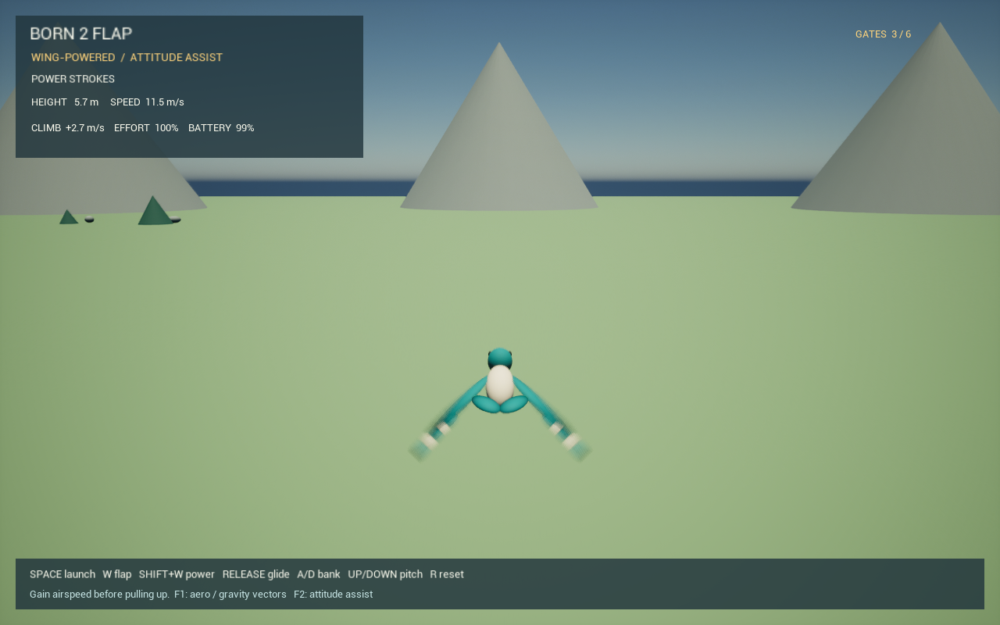

# Wing-powered flight — 24 September 2026

The previous trainer kept flying with little visible wing motion because its
controller cancelled the measured aerodynamic forces and supplied whatever force
was needed to hold altitude and speed. That made the flight model irrelevant to
the player's energy budget. This revision removes that compensation.

## Current flight and controls

After an explicit hand launch, translation comes from the native wing/body/tail
forces, gravity and ground contact. There is no altitude target, speed target,
extra lift or linear damping. A bounded attitude torque helps hold the requested
pitch and bank, with coordinated yaw. Pitch and roll are physically free.
F2 disables this attitude assistance; raw flight still needs trim/calibration.

| Input | Result |
| --- | --- |
| Space, while resting on the ground | Hand launch: 8.5 m/s forward, 2.2 m/s upward, 1.4 m release height |
| Hold W | Continuous flapping at 72% effort |
| Hold Shift + W | Full effort, greater stroke demand and cadence |
| Release W | Glide; airspeed and height are spent |
| A / D | Bank left / right |
| Up / Down, or S for down | Raise / lower the nose; pulling up costs airspeed |
| R | Reset body and the complete native firmware/servo/wing/battery state |
| F1 | Cyan aerodynamic force and red weight vectors |
| F2 | Toggle attitude assistance |

The hand launch cannot repeat in the air. The field-return helper only steers
when attitude assistance is enabled; it cannot hold altitude. HUD effort,
battery, airspeed and climb rate reflect the live simulation. Wings display the
actual loaded servo angles, not a separate animation oscillator.

## Model changes and defects found

- The old fixed high cadence and 2 N·m hinge drive could saturate the actuator.
  At sufficient airspeed the wings remained against their travel limit. The
  prototype now uses a 1200°/s, 8 N·m hinge actuator, an 11.1 V / 1.3 Ah battery,
  and throttle-dependent cadence from 0.5 to 3.2 Hz. Aerodynamic load still slows
  or backdrives the actuator. Assisting load no longer reduces tracking speed
  as though it opposed the requested movement.
- The previous high incidence produced excessive drag. Root/elbow/tip incidence
  is now 5° / 2° / −2°. A provisional passive-feathering approximation follows
  part of the flap-induced inflow, allowing a useful stroke without holding a
  rigid plate deep into stall. Forces still come from local flow and section
  coefficients. The formula is in [physics-convention.md](physics-convention.md).
- Frame-held angular velocity destabilized aerodynamic roll damping at 30 fps.
  The 240 Hz native loop now predicts linear velocity, angular velocity and
  orientation between evaluations, then applies the mean loads once to Chaos.
  It does not add duplicate impulses. Chaos owns the actual body and contacts.
- Course ring collision was being restored while mesh physics state was
  recreated. A logged ring impact explained a sudden speed loss and crash.
  Decorative actors now explicitly retain their no-collision profile after
  mesh/scale setup. The floor remains solid. The first gates are lower to fit
  the new powered climb.

## Reproduced checks

Windows: GHC 9.10.3, native ABI v2, Unreal 5.8.2, MSVC 14.44.
Both `Born2FlapEditor` and `Born2Flap` Development targets compile successfully.
The Haskell test suite, native ABI smoke test and existing passive-force/contact
regression pass. Build/run instructions are in
[windows-development.md](windows-development.md).

`Native/tests/aerodynamic_flight.py` runs three 30-second trajectories with the
actual shared library and the game's actuator selection. It integrates force
and gravity with the body held level, starting at 100 m and the same initial
velocity. This isolates the energy budget; it is not a six-axis flight test.

| Effort | Height change | Mechanical energy change | Final speed | Wing travel during last 5 s |
| --- | ---: | ---: | ---: | ---: |
| 0% | −68.879 m | −317.444 J | 4.199 m/s | 0° |
| 72% | +21.747 m | +99.714 J | 9.675 m/s | 88.49° |
| 100% | +29.696 m | +144.110 J | 11.616 m/s | 93.55° |

The unpowered case cannot exceed its initial mechanical energy. The powered
cases must gain energy, maintain substantial late wing travel, and respond to
increased effort. This regression is also included in native CI.

The real Unreal pawn, native library and Chaos pass the same 75-second sequence
at three frame rates: ground idle, launch, W, release, full effort, pull-up,
turn, glide to a stop, reset and relaunch.

| FPS | Height before / after 3 s glide | Pull-up speed before / after | Pull-up height before / after | Peak speed | Safety resets / math failures |
| --- | --- | --- | --- | ---: | --- |
| 30 | 7.861 / 6.879 m | 11.64 / 10.69 m/s | 14.67 / 19.14 m | 11.788 m/s | 0 / 0 |
| 60 | 7.823 / 6.742 m | 11.64 / 10.70 m/s | 14.38 / 18.85 m | 11.781 m/s | 0 / 0 |
| 144 | 7.834 / 6.750 m | 11.62 / 10.69 m/s | 14.41 / 18.87 m | 11.790 m/s | 0 / 0 |

The 180-second powered turning test also passes: final altitude 146.31 m,
speed 9.75 m/s, peak speed 10.53 m/s, no safety reset or math failure.
These are simulated results with attitude assistance enabled, not measurements
of a physical ornithopter. The tests replace pilot input; rendering and window
keyboard input are checked separately.

The rendered 60 fps test produces the same PASS values. Its captured image
above shows the actual bird and HUD during a powered stroke.

The normal game window was also exercised through targeted Windows key events
without the scripted test mode: Space, W, release, left Shift + W, Up, D and R.
Telemetry confirmed 72% versus 100% effort, resumed strokes after a glide,
speed loss while pitching up, a turn, and a complete reset. No safety reset or
math rejection occurred. Modifier testing used the explicit left-shift key
because Unreal polls the OS key state and releases a synthetic generic Shift.

## Limits

This is a wing-driven playable prototype, not an experimentally calibrated
aircraft. Feathering is quasi-static, actuator/gearbox data and rotational
inertia are provisional, and the attitude helper supplies artificial torque.
Its energy contribution to rotation is not counted by the level-body energy
test. Added mass remains omitted pending an implicit fluid/body solve; tail
forces under arbitrary flow and completely unassisted trim need more work.
The native Haskell and isolated C++ research models are not yet reconciled.

The [earlier stability report](flight-stability-2026-09-24.md) is retained as a
historical record of the drag-sign repair and the now-replaced trainer.
